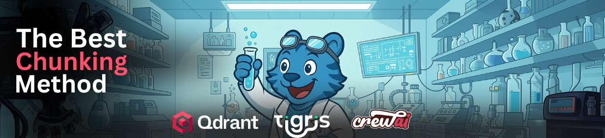

# Tigris RAG Lab



Upload your dataset and find the optimal chunking strategy for your doc. Store all chunking experiments in Tigris, index them via Qdrant, and run evaluation with CrewAI.

## Quick Start

1. **Setup:**
   ```bash
   python -m venv .venv
   source .venv/bin/activate
   pip install -r requirements.txt
   ```

2. **Configure `.env`:**
   ```bash
   S3_ENDPOINT=https://t3.storage.dev
   ACCESS_KEY=your_tigris_access_key
   SECRET_ACCESS_KEY=your_tigris_secret_key
   QDRANT_URL=https://your-qdrant-cluster.qdrant.io
   QDRANT_KEY=your_qdrant_api_key
   OPENAI_API_KEY=your_openai_key  # For CrewAI agents
   ```

3. **Run:**
   ```bash
   streamlit run streamlit_app.py
   ```

## Key Files

- `streamlit_app.py` - Web UI for uploading datasets and running experiments
- `crew.py` - CrewAI agents that orchestrate experiments
- `dataset.py` - Tigris bucket management (create, fork, snapshot)
- `chunk.py` - Pre-chunk documents before ingestion
- `ingest.py` - Build Qdrant collections from pre-chunked data
- `eval.py` - Evaluate collections with document-grounded metrics
- `run_all.sh` - Batch script to run all experiments

## How It Works

1. Upload a text file → Creates a Tigris bucket
2. Agent selects top 3 chunking strategies
3. For each strategy: fork bucket → pre-chunk → build Qdrant collection
4. Evaluate all collections → Compare scores
5. Keep winner, delete losers

Experiments are versioned in Tigris, indexed in Qdrant, and evaluated by CrewAI agents.
